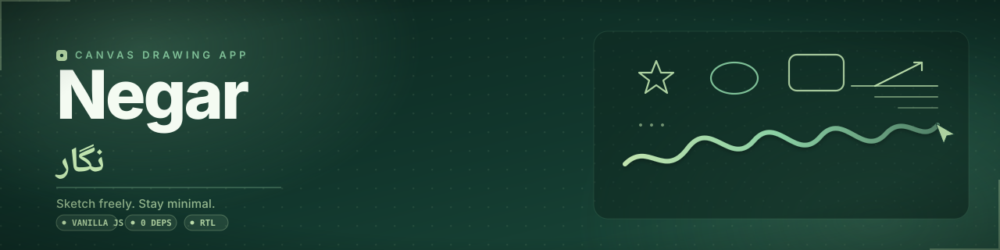
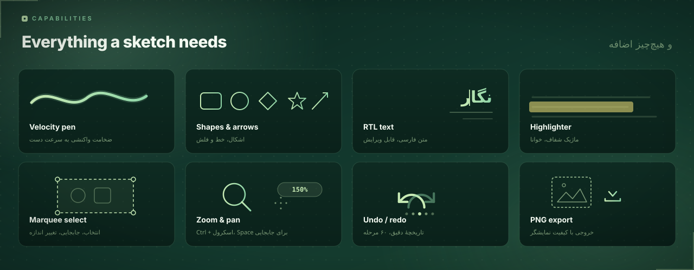
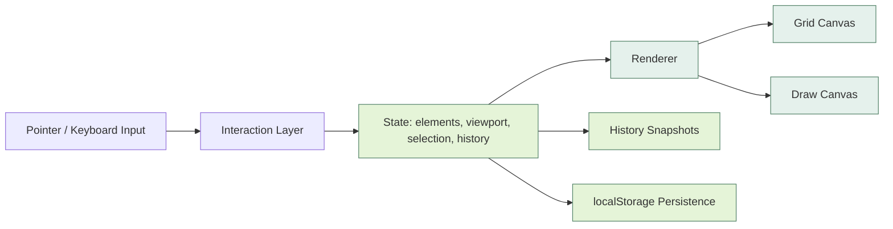
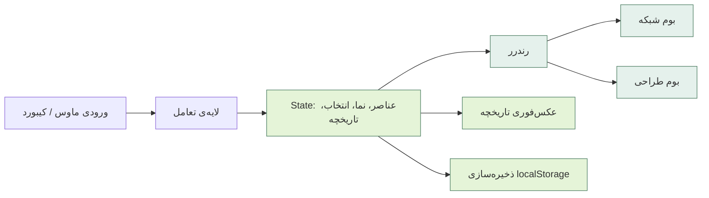

<a id="top"></a>

<div align="center">



<a href="#top">ENGLISH</a> · <a href="#بالا">فارسی</a>


</div>

---

# Negar

**A minimal, RTL-first sketching canvas that runs in a single HTML file.** No framework, no bundler, no build step — open `index.html` and draw. The interface is Persian by default and feels like a native desktop tool.

`Features` · `Tools` · `Stack` · `Architecture` · `Quick start` · `Shortcuts` · `Meet Leo`



## 01 / Features

<table>
<tr>
<td width="50%">

### ↗ Velocity-reactive pen

Three pen styles — ballpoint, brush, marker — each with its own speed threshold, width ratio, and taper. Strokes respond to how fast you draw.

</td>
<td width="50%">

### ◉ Full editor history

Undo and redo with a 60-step cap. Every change is an exact snapshot, not an approximation.

</td>
</tr>
<tr>
<td width="50%">

### ◇ Thirteen tools, one bar

Select, hand, pen, highlighter, eraser, text, lines, arrows, and five shape primitives — each one key away.

</td>
<td width="50%">

### ⌘ Keyboard-first editing

Nudge, duplicate, reorder layers, multi-select, and pan without touching the mouse.

</td>
</tr>
<tr>
<td width="50%">

### ◐ Persistent by default

Every change autosaves to `localStorage`. Reload, and the canvas is exactly as you left it.

</td>
<td width="50%">

### ☾ Light and dark

Theme choice persists across sessions.

</td>
</tr>
</table>

**Highlights at a glance:** `zero dependencies` `zero build step` `RTL-native` `60-step undo` `DPR-aware PNG export` `marquee multi-select`

## 02 / Tools

| Tool | What it does | Key |
|---|---|---|
| Select | Click to select, drag to move, marquee for multi-select, corner handles to resize, Shift locks aspect ratio | `V` |
| Hand | Pan the canvas; also middle mouse or holding Space | `H` |
| Pen | Freehand drawing with velocity-reactive width, smoothing, tapered ends | `P` |
| Highlighter | Wide, translucent, multiply-blended marks | `M` |
| Eraser | Removes whole strokes and shapes on contact | `E` |
| Text | Editable RTL text anywhere on canvas; double-click to edit in place | `T` |
| Line | Straight line, constrained to angles with Shift | `L` |
| Arrow | Line with an arrowhead scaled to stroke width | `A` |
| Rectangle | Rounded corners, optional fill | `R` |
| Ellipse | Optional fill | `O` |
| Diamond | Rhombus aligned to the drag box | `D` |
| Triangle | Isosceles, aligned to the drag box | `G` |
| Star | Five-point, aspect-aware | `S` |

Every element carries its own stroke color, width, opacity, and fill — set per element, not globally.

## 03 / Stack

| Layer | Foundation | Notes |
|---|---|---|
| Runtime | Vanilla JavaScript (ES2020+) | No bundler, no transpilation |
| Rendering | HTML5 Canvas 2D | DPR-aware for sharp output |
| Input | Pointer Events | Coalesced events for high-fidelity pen and touch |
| Persistence | `localStorage` (JSON) | Decoupled from the UI |
| Typography | Vazirmatn | RTL-first typeface |
| Styling | Hand-written CSS | Custom properties, `color-mix()`, backdrop blur |

## 04 / Architecture



The interaction layer is the only part of Negar that touches raw pointer and keyboard events, translating them into intent. State is the single source of truth — element graph, viewport, selection, and history index — and the renderer is a pure function of it, redrawing both canvases on every change rather than mutating them. History snapshots the element graph as JSON, making undo and redo exact rather than reconstructed. Persistence to `localStorage` reacts to state changes without knowing what triggered them.

Each layer can change without the others noticing — a new tool only needs to speak to state.

## 05 / Quick start

**Prerequisites:** a modern browser.

```bash
git clone https://github.com/here-is-leo/negar.git
cd negar
```

**Option 1 — open directly**

```bash
open index.html
```

**Option 2 — serve locally**

```bash
python3 -m http.server
```

Negar is fully static. Host it anywhere that serves plain files — GitHub Pages, Netlify, and Cloudflare Pages all work with zero configuration.

## 06 / Keyboard

<details open>
<summary><strong>Tools</strong></summary>

| Action | Key |
|---|---|
| Select | `V` |
| Hand | `H` |
| Pen | `P` |
| Highlighter | `M` |
| Eraser | `E` |
| Text | `T` |
| Line | `L` |
| Arrow | `A` |
| Rectangle | `R` |
| Ellipse | `O` |
| Diamond | `D` |
| Triangle | `G` |
| Star | `S` |

</details>

<details>
<summary><strong>Editing</strong></summary>

| Action | Key |
|---|---|
| Undo / Redo | `Ctrl+Z` / `Ctrl+Shift+Z` |
| Copy / Cut / Paste | `Ctrl+C` / `Ctrl+X` / `Ctrl+V` |
| Duplicate | `Ctrl+D` |
| Select all | `Ctrl+A` |
| Delete selection | `Delete` / `Backspace` |
| Nudge (×10 with Shift) | `↑` `↓` `←` `→` |
| Bring forward / Send backward | `Ctrl+]` / `Ctrl+[` |

</details>

<details>
<summary><strong>Navigation & view</strong></summary>

| Action | Key |
|---|---|
| Pan | `Space` + drag |
| Zoom | `Ctrl` + scroll |
| Zoom in / out | `Ctrl+` `+` / `Ctrl+` `-` |
| Reset to 100% | `Ctrl+0` |
| Toggle help | `?` |
| Cancel / deselect | `Esc` |

</details>

<details>
<summary><strong>Smart clicks</strong></summary>

| Action | Key |
|---|---|
| Full context menu | Right-click canvas |
| Edit text in place | Double-click text |
| Instant duplicate + drag | `Alt` + click element |
| Add to selection | `Ctrl` + click element |
| Intersection select | Marquee drag right |
| Enclosed select | Marquee drag left |

</details>

## 07 / Meet the developer

<div align="center">


**Ilia Farahani (Leo)**
ایلیا فاراهانی (لئو)

[@here-is-leo](https://github.com/here-is-leo)

</div>

---

<div dir="rtl">

<a id="بالا"></a>

<div align="center">


</div>

# نگار

**یک بوم طراحی مینیمال و راست‌به‌چپ، در قالب یک فایل HTML.** بدون فریم‌ورک، بدون باندلر، بدون build — کافی‌ست `index.html` را باز کنید. رابط کاربری از همان ابتدا فارسی‌ست و حس یک ابزار دسکتاپ را می‌دهد، نه یک وب‌اپ.

`ویژگی‌ها` · `ابزارها` · `پشته‌ی فناوری` · `معماری` · `شروع سریع` · `میان‌برها` · `آشنایی با لئو`

## ۰۱ / ویژگی‌ها

<table dir="rtl">
<tr>
<td width="50%">

### ↗ قلم حساس به سرعت

سه سبک قلم — خودکار، برس، ماژیک — هر کدام با آستانه‌ی سرعت و باریک‌شدگی خودش. خط به سرعت دست واکنش نشان می‌دهد.

</td>
<td width="50%">

### ◉ تاریخچه‌ی کامل

Undo و redo تا ۶۰ مرحله. هر تغییر دقیقاً همان‌طور که رخ داده ذخیره می‌شود.

</td>
</tr>
<tr>
<td width="50%">

### ◇ سیزده ابزار، یک نوار

انتخاب، دست، قلم، ماژیک، پاک‌کن، متن، خط، فلش و پنج شکل پایه، همه با یک کلید.

</td>
<td width="50%">

### ⌘ ویرایش با کیبورد

جابه‌جایی جزئی، تکرار، تغییر ترتیب لایه‌ها و انتخاب چندگانه، بدون دست بردن به ماوس.

</td>
</tr>
<tr>
<td width="50%">

### ◐ ذخیره‌ی خودکار

هر تغییر در `localStorage` ذخیره می‌شود. صفحه را رفرش کنید — بوم همان‌جایی‌ست که گذاشتید.

</td>
<td width="50%">

### ☾ روشن و تاریک

تم انتخابی بین جلسات حفظ می‌شود.

</td>
</tr>
</table>

**نگاه سریع:** `بدون وابستگی` `بدون build` `راست‌به‌چپ بومی` `۶۰ مرحله undo` `خروجی PNG متناسب با DPR` `انتخاب چندگانه‌ی مارکی`

## ۰۲ / ابزارها

<table dir="rtl">
<tr><th>ابزار</th><th>کارکرد</th><th>کلید</th></tr>
<tr><td>انتخاب</td><td>کلیک برای انتخاب، کشیدن برای جابه‌جایی، مارکی برای انتخاب چندگانه، دسته‌ها برای تغییر اندازه، Shift برای حفظ نسبت</td><td><code>V</code></td></tr>
<tr><td>دست</td><td>جابه‌جایی بوم؛ یا دکمه‌ی وسط ماوس، یا نگه‌داشتن Space</td><td><code>H</code></td></tr>
<tr><td>قلم</td><td>طراحی آزاد با ضخامت حساس به سرعت و انتهای باریک‌شده</td><td><code>P</code></td></tr>
<tr><td>ماژیک</td><td>خطوط پهن و نیمه‌شفاف</td><td><code>M</code></td></tr>
<tr><td>پاک‌کن</td><td>با یک تماس، کل خط یا شکل حذف می‌شود</td><td><code>E</code></td></tr>
<tr><td>متن</td><td>متن راست‌به‌چپ روی بوم؛ دوبار کلیک برای ویرایش</td><td><code>T</code></td></tr>
<tr><td>خط</td><td>خط مستقیم، با Shift محدود به زاویه‌های ثابت</td><td><code>L</code></td></tr>
<tr><td>فلش</td><td>خط با سرفلش متناسب با ضخامت</td><td><code>A</code></td></tr>
<tr><td>مستطیل</td><td>گوشه‌های گرد، قابل پر کردن</td><td><code>R</code></td></tr>
<tr><td>بیضی</td><td>قابل پر کردن</td><td><code>O</code></td></tr>
<tr><td>لوزی</td><td>هم‌راستا با کادر کشیده‌شده</td><td><code>D</code></td></tr>
<tr><td>مثلث</td><td>متساوی‌الساقین، هم‌راستا با کادر</td><td><code>G</code></td></tr>
<tr><td>ستاره</td><td>پنج‌پر، متناسب با ابعاد</td><td><code>S</code></td></tr>
</table>

هر عنصر رنگ، ضخامت، شفافیت و پرکردگی خودش را دارد — جدا از بقیه.

## ۰۳ / پشته‌ی فناوری

<table dir="rtl">
<tr><th>لایه</th><th>پایه</th><th>توضیح</th></tr>
<tr><td>Runtime</td><td>جاوااسکریپت خالص (ES2020+)</td><td>بدون باندلر، بدون transpile</td></tr>
<tr><td>رندر</td><td>HTML5 Canvas 2D</td><td>متناسب با DPR</td></tr>
<tr><td>ورودی</td><td>Pointer Events</td><td>رویدادهای coalesced برای دقت قلم و لمس</td></tr>
<tr><td>ذخیره‌سازی</td><td><code>localStorage</code> (JSON)</td><td>مستقل از رابط کاربری</td></tr>
<tr><td>تایپوگرافی</td><td>وزیرمتن</td><td>فونت راست‌به‌چپ‌محور</td></tr>
<tr><td>استایل</td><td>CSS دست‌نویس</td><td>custom properties، <code>color-mix()</code>، backdrop blur</td></tr>
</table>

## ۰۴ / معماری



تنها لایه‌ای از نگار که مستقیماً با رویدادهای خام ماوس و کیبورد سروکار دارد، لایه‌ی تعامل است؛ کارش فقط ترجمه‌ی این رویدادها به قصد کاربر است. State منبع واحد حقیقت است — گراف عناصر، نما، انتخاب، شاخص تاریخچه — و رندرر تابعی خالص از همین State است که در هر تغییر هر دو بوم را از نو می‌کشد. تاریخچه با عکس‌فوری گرفتن از گراف عناصر در قالب JSON کار می‌کند، برای همین undo و redo دقیق‌اند، نه بازسازی‌شده. ذخیره‌سازی در `localStorage` به تغییرات State واکنش نشان می‌دهد بی‌آن‌که بداند چه چیزی آن تغییر را ایجاد کرده.

هر لایه مستقل از بقیه تغییر می‌کند — یک ابزار تازه فقط باید با State حرف بزند.

## ۰۵ / شروع سریع

**پیش‌نیاز:** یک مرورگر مدرن.

```bash
git clone https://github.com/here-is-leo/negar.git
cd negar
```

**گزینه‌ی اول — باز کردن مستقیم**

```bash
open index.html
```

**گزینه‌ی دوم — سرو روی سرور محلی**

```bash
python3 -m http.server
```

نگار کاملاً استاتیک است؛ هر جایی که فایل ساده سرو می‌کند جواب می‌دهد — GitHub Pages، Netlify و Cloudflare Pages، همه بدون پیکربندی.

## ۰۶ / میان‌برهای کیبورد

<details open dir="rtl">
<summary><strong>ابزارها</strong></summary>

<table dir="rtl">
<tr><th>عملکرد</th><th>کلید</th></tr>
<tr><td>انتخاب</td><td><code>V</code></td></tr>
<tr><td>دست</td><td><code>H</code></td></tr>
<tr><td>قلم</td><td><code>P</code></td></tr>
<tr><td>ماژیک</td><td><code>M</code></td></tr>
<tr><td>پاک‌کن</td><td><code>E</code></td></tr>
<tr><td>متن</td><td><code>T</code></td></tr>
<tr><td>خط</td><td><code>L</code></td></tr>
<tr><td>فلش</td><td><code>A</code></td></tr>
<tr><td>مستطیل</td><td><code>R</code></td></tr>
<tr><td>بیضی</td><td><code>O</code></td></tr>
<tr><td>لوزی</td><td><code>D</code></td></tr>
<tr><td>مثلث</td><td><code>G</code></td></tr>
<tr><td>ستاره</td><td><code>S</code></td></tr>
</table>

</details>

<details dir="rtl">
<summary><strong>ویرایش</strong></summary>

<table dir="rtl">
<tr><th>عملکرد</th><th>کلید</th></tr>
<tr><td>Undo / Redo</td><td><code>Ctrl+Z</code> / <code>Ctrl+Shift+Z</code></td></tr>
<tr><td>کپی / برش / چسباندن</td><td><code>Ctrl+C</code> / <code>Ctrl+X</code> / <code>Ctrl+V</code></td></tr>
<tr><td>تکرار</td><td><code>Ctrl+D</code></td></tr>
<tr><td>انتخاب همه</td><td><code>Ctrl+A</code></td></tr>
<tr><td>حذف انتخاب</td><td><code>Delete</code> / <code>Backspace</code></td></tr>
<tr><td>جابه‌جایی جزئی (×۱۰ با Shift)</td><td><code>↑</code> <code>↓</code> <code>←</code> <code>→</code></td></tr>
<tr><td>آوردن به جلو / بردن به عقب</td><td><code>Ctrl+]</code> / <code>Ctrl+[</code></td></tr>
</table>

</details>

<details dir="rtl">
<summary><strong>ناوبری و نما</strong></summary>

<table dir="rtl">
<tr><th>عملکرد</th><th>کلید</th></tr>
<tr><td>جابه‌جایی بوم</td><td><code>Space</code> + کشیدن</td></tr>
<tr><td>بزرگ‌نمایی</td><td><code>Ctrl</code> + اسکرول</td></tr>
<tr><td>بزرگ‌نمایی / کوچک‌نمایی</td><td><code>Ctrl+</code> <code>+</code> / <code>Ctrl+</code> <code>-</code></td></tr>
<tr><td>بازگشت به ۱۰۰٪</td><td><code>Ctrl+0</code></td></tr>
<tr><td>نمایش راهنما</td><td><code>?</code></td></tr>
<tr><td>لغو / خروج از انتخاب</td><td><code>Esc</code></td></tr>
</table>

</details>

<details dir="rtl">
<summary><strong>کلیک‌های هوشمند</strong></summary>

<table dir="rtl">
<tr><th>عملکرد</th><th>کلید</th></tr>
<tr><td>منوی کامل کلیک راست</td><td>کلیک راست روی بوم</td></tr>
<tr><td>ویرایش متن در همان‌جا</td><td>دوبار کلیک روی متن</td></tr>
<tr><td>تکرار فوری + کشیدن</td><td><code>Alt</code> + کلیک روی عنصر</td></tr>
<tr><td>افزودن به انتخاب</td><td><code>Ctrl</code> + کلیک روی عنصر</td></tr>
<tr><td>انتخاب تقاطعی</td><td>کشیدن مارکی به راست</td></tr>
<tr><td>انتخاب محصورکننده</td><td>کشیدن مارکی به چپ</td></tr>
</table>

</details>

## ۰۷ / آشنایی با توسعه‌دهنده

<div align="center">


**ایلیا فاراهانی (لئو)**
Ilia Farahani (Leo)

[@here-is-leo](https://github.com/here-is-leo)

</div>

</div>

---

<div align="center">

**NEGAR**
Sketch freely. Stay minimal.

[بازگشت به بالا ↑](#top)

</div>
