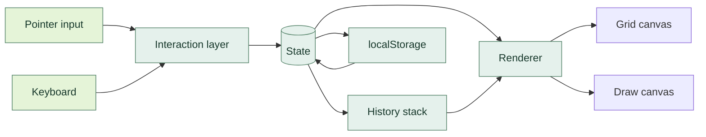

<a id="top"></a>

<div align="center">
  
  <br /><br />
  <a href="#english"><strong>ENGLISH</strong></a> &nbsp; / &nbsp; <a href="#persian"><strong>فارسی</strong></a>
  <br /><br />
  
  
  
  
  
  
</div>

<br />

<a id="english"></a>

# Negar

**A canvas with nothing in the way.** Open it and draw. Negar is a minimal, RTL-first sketching surface built on the HTML5 Canvas — with a handwriting engine that responds to speed, precise shape tools, text and highlighter, and a full editing history. No frameworks. No build step. No dependencies.

<p>
<a href="#features">Features</a> &nbsp;·&nbsp;
<a href="#tools">Tools</a> &nbsp;·&nbsp;
<a href="#stack">Stack</a> &nbsp;·&nbsp;
<a href="#architecture">Architecture</a> &nbsp;·&nbsp;
<a href="#start">Quick start</a> &nbsp;·&nbsp;
<a href="#shortcuts">Shortcuts</a> &nbsp;·&nbsp;
<a href="#developer">Meet Leo</a>
</p>

<br />


<br />

<a id="features"></a>

## 01 / Everything a sketch needs, and nothing it doesn't

<table>
<tr>
<td width="50%" valign="top">
<h3>↗ A pen that behaves like a pen</h3>
<p>A velocity-driven freehand engine adjusts stroke width to hand speed, smooths jitter, and tapers stroke ends — so writing and sketching feel natural, not mechanical.</p>
</td>
<td width="50%" valign="top">
<h3>◉ Shapes that stay clean</h3>
<p>Rectangle, ellipse, line, arrow — with dashed and dotted styles, custom stroke widths, and <kbd>Shift</kbd> to constrain proportions. Fillable, layered, and reorderable.</p>
</td>
</tr>
<tr>
<td valign="top">
<h3>◇ Text and highlighting</h3>
<p>Place RTL-aware text anywhere on the canvas. Highlight with a multiply-blended marker that keeps the content beneath readable. Double-click any text to edit it in place.</p>
</td>
<td valign="top">
<h3>⌘ An editor beneath the surface</h3>
<p>Full undo and redo. Multi-select with a marquee. Copy, paste, duplicate, lock, and reorder. Drag to move, grab a corner to resize, nudge with the arrow keys.</p>
</td>
</tr>
<tr>
<td valign="top">
<h3>◐ A viewport you control</h3>
<p>Pan with <kbd>Space</kbd> or the middle mouse. Zoom with <kbd>Ctrl</kbd> + scroll, or zoom to fit your content. Toggle the dot grid. Reset to 100% at any time.</p>
</td>
<td valign="top">
<h3>☾ Persistent and portable</h3>
<p>Everything autosaves to local storage and restores on reload. Export the full canvas as a PNG at your display's pixel density. Light and dark themes, one click apart.</p>
</td>
</tr>
</table>

**Highlights at a glance**

`Velocity-based pen` · `3 pen styles` · `Highlighter` · `Shapes + arrows` · `RTL text` · `Marquee select` · `Resize handles` · `Undo / redo` · `Copy / paste` · `Lock & layer order` · `Autosave` · `PNG export` · `Dark mode` · `Keyboard-first`

<a id="tools"></a>

## 02 / The toolbar, in detail

| Tool | What it does | Key |
|:---|:---|:---|
| **Select** | Click to select, drag to move, marquee to multi-select, handles to resize | `V` |
| **Hand** | Pan the canvas freely — also middle mouse, or hold `Space` | `H` |
| **Pen** | Freehand with speed-reactive width and smoothed strokes | `P` |
| **Highlighter** | Wide, translucent, multiply-blended marks | `M` |
| **Eraser** | Removes whole strokes and shapes on contact | `E` |
| **Text** | Editable RTL text anywhere on the canvas | `T` |
| **Line** | Straight line, constrained with `Shift` | `L` |
| **Arrow** | Line with an arrowhead that scales with stroke width | `A` |
| **Rectangle** | Rounded rectangle, optionally filled | `R` |
| **Ellipse** | Perfect ellipse, optionally filled | `O` |
| **Diamond** | Rhombus aligned to the drag box | `D` |
| **Triangle** | Isosceles triangle aligned to the drag box | `G` |
| **Star** | Five-point star, aspect-aware | `S` |

Every stroke and shape carries its own color, width, opacity, dash style, and fill — chosen from the style panel before or after drawing.

<a id="stack"></a>

## 03 / Built on a focused stack

| Layer | Foundation | Notes |
|:---|:---|:---|
| **Runtime** | Vanilla JavaScript (ES2020+) | No bundler, no framework, no runtime dependency |
| **Rendering** | HTML5 Canvas 2D | Separate grid and draw layers, DPR-aware |
| **Input** | Pointer Events + coalesced events | Mouse, trackpad, pen, and touch through one path |
| **Persistence** | `localStorage` | Element graph serialized as JSON, restored on load |
| **Typography** | Vazirmatn | RTL-first interface and canvas text |
| **Styling** | Hand-written CSS with custom properties | Theme tokens, `color-mix()`, backdrop blur |

<a id="architecture"></a>

## 04 / Clear responsibilities at every layer



**Interaction** translates raw pointer and keyboard events into intent: drawing, selecting, panning, resizing, erasing. **State** holds the element graph, the viewport, the selection, and the history index. **Renderer** redraws the scene from state on every change, so what you see is always a pure function of what is stored. **History** snapshots the element graph, which makes undo and redo exact rather than approximate.

Nothing couples rendering to input. Nothing couples persistence to the interface. Adding a new tool means teaching the interaction layer one new shape.

<a id="start"></a>

## 05 / From source to running locally

**Prerequisites:** a modern browser. That is all. There is no build step.

### Get the source

```bash
git clone https://github.com/here-is-leo/negar.git
cd negar
```

### Open it

```bash
# Option 1 — open the file directly
open index.html          # macOS
xdg-open index.html      # Linux
start index.html         # Windows

# Option 2 — serve it locally (recommended for testing on other devices)
python3 -m http.server 8080
# then visit http://localhost:8080
```

### Host it anywhere

Negar is fully static, so any host works: GitHub Pages, Netlify, Cloudflare Pages, or a folder on your own server. Push the files, point the host at `index.html`, done.

<a id="shortcuts"></a>

## 06 / Keyboard, without lifting your hands

<details open>
<summary><strong>Tools</strong></summary>

| Action | Keys |
|:---|:---|
| Select / Hand / Pen / Highlighter / Eraser / Text | `V` `H` `P` `M` `E` `T` |
| Line / Arrow / Rectangle / Ellipse | `L` `A` `R` `O` |
| Diamond / Triangle / Star | `D` `G` `S` |

</details>

<details>
<summary><strong>Editing</strong></summary>

| Action | Keys |
|:---|:---|
| Undo / Redo | `Ctrl` + `Z` / `Ctrl` + `Shift` + `Z` |
| Copy / Cut / Paste | `Ctrl` + `C` / `X` / `V` |
| Duplicate | `Ctrl` + `D` |
| Select all / Delete | `Ctrl` + `A` / `Delete` |
| Nudge selection | `↑ ↓ ← →` — hold `Shift` for ×10 |
| Bring forward / Send backward | `Ctrl` + `]` / `Ctrl` + `[` |

</details>

<details>
<summary><strong>Navigation & view</strong></summary>

| Action | Keys |
|:---|:---|
| Pan canvas | Hold `Space` and drag, or middle mouse |
| Zoom | `Ctrl` + scroll |
| Zoom in / out | `Ctrl` + `+` / `Ctrl` + `-` |
| Reset zoom to 100% | `Ctrl` + `0` |
| Toggle help | `?` |
| Cancel current action | `Esc` |

</details>

<details>
<summary><strong>Smart clicks</strong></summary>

| Gesture | Result |
|:---|:---|
| Right-click on canvas | Full context menu |
| Double-click on text | Edit in place |
| `Alt` + click on an element | Instant duplicate and drag |
| `Ctrl` + click on an element | Add to current selection |
| Drag marquee right | Intersection select |
| Drag marquee left | Enclosed select |

</details>

<a id="developer"></a>

## 07 / The developer behind the project

<a href="https://github.com/here-is-leo"></a>

<p align="center"><strong>Ilia Farahani (Leo) · ایلیا فاراهانی (لئو)</strong><br />Senior Developer · برنامه‌نویس ارشد پروژه<br /><br /><a href="https://github.com/here-is-leo">GitHub / @here-is-leo ↗</a></p>

<br />

---

<a id="persian"></a>

<h1 dir="rtl">نگار</h1>
<p dir="rtl"><strong>بومی که هیچ‌چیز سر راهت نیست.</strong> بازش کن و بکش. نگار یک سطح طراحی مینیمال و راست‌به‌چپ روی Canvas مرورگر است؛ با موتور دست‌نویسی که به سرعت دست واکنش می‌دهد، ابزارهای دقیق اشکال، متن و هایلایت، و یک تاریخچهٔ کامل ویرایش. بدون فریم‌ورک، بدون مرحلهٔ بیلد، بدون هیچ وابستگی.</p>

<p dir="rtl"><a href="#fa-features">قابلیت‌ها</a> · <a href="#fa-tools">ابزارها</a> · <a href="#fa-stack">فناوری‌ها</a> · <a href="#fa-architecture">معماری</a> · <a href="#fa-start">راه‌اندازی</a> · <a href="#fa-shortcuts">میان‌برها</a> · <a href="#fa-developer">برنامه‌نویس</a></p>

<br />


<br />

<a id="fa-features"></a>

<h2 dir="rtl">۰۱ / هر آنچه یک اسکچ لازم دارد، و هیچ‌چیز اضافه</h2>

<table dir="rtl">
<tr>
<td width="50%" valign="top"><h3>↗ قلمی که مثل قلم رفتار می‌کند</h3><p>موتور دست‌نویسی حساس به سرعت، ضخامت خط را با تندی حرکت دست تنظیم می‌کند، لرزش را نرم می‌کند و انتهای خط را باریک می‌کند — تا نوشتن و کشیدن طبیعی باشد، نه مکانیکی.</p></td>
<td width="50%" valign="top"><h3>◉ اشکالی که تمیز می‌مانند</h3><p>مستطیل، بیضی، خط و فلش — با سبک‌های خط‌چین و نقطه‌چین، ضخامت دلخواه و <kbd>Shift</kbd> برای حفظ نسبت‌ها. قابل پر کردن، لایه‌بندی و تغییر ترتیب.</p></td>
</tr>
<tr>
<td valign="top"><h3>◇ متن و هایلایت</h3><p>متن را هر جای بوم بگذار — با پشتیبانی کامل از راست‌به‌چپ. با ماژیکِ multiply هایلایت کن تا محتوای زیرش خوانا بماند. با دابل‌کلیک روی هر متن، همان‌جا ویرایشش کن.</p></td>
<td valign="top"><h3>⌘ ویرایشگری زیر پوسته</h3><p>واگرد و ازنوی کامل. انتخاب چندگانه با کادر. کپی، چسباندن، تکثیر، قفل و تغییر ترتیب. جابجایی با کشیدن، تغییر اندازه با گوشه‌ها، جابجایی دقیق با کلیدهای جهت.</p></td>
</tr>
<tr>
<td valign="top"><h3>◐ نمایی که در کنترل توست</h3><p>با <kbd>Space</kbd> یا دکمهٔ وسط ماوس بوم را جابجا کن. با <kbd>Ctrl</kbd> + اسکرول زوم کن، یا به اندازهٔ محتوا زوم کن. شبکهٔ نقطه‌ای را خاموش و روشن کن و هر وقت خواستی به ۱۰۰٪ برگرد.</p></td>
<td valign="top"><h3>☾ ماندگار و قابل حمل</h3><p>همه‌چیز خودکار در حافظهٔ محلی ذخیره و در بارگذاری بعدی بازیابی می‌شود. کل بوم را با تراکم پیکسلی نمایشگرت به‌صورت PNG خروجی بگیر. تم روشن و تاریک، یک کلیک فاصله دارند.</p></td>
</tr>
</table>

<p dir="rtl"><strong>نگاه یک‌خطی:</strong> قلم حساس به سرعت · سه سبک قلم · هایلایت · اشکال و فلش · متن راست‌به‌چپ · انتخاب کادری · دستگیره‌های تغییر اندازه · واگرد و ازنو · کپی و چسباندن · قفل و ترتیب لایه · ذخیرهٔ خودکار · خروجی PNG · حالت تاریک · کاملاً مبتنی بر کیبورد</p>

<a id="fa-tools"></a>

<h2 dir="rtl">۰۲ / نوار ابزار، با جزئیات</h2>

<table dir="rtl">
<tr><th>ابزار</th><th>کارکرد</th><th>کلید</th></tr>
<tr><td><strong>انتخاب</strong></td><td>کلیک برای انتخاب، کشیدن برای جابجایی، کادر برای انتخاب چندگانه، گوشه‌ها برای تغییر اندازه</td><td><code>V</code></td></tr>
<tr><td><strong>جابجایی</strong></td><td>جابجایی آزاد بوم — با دکمهٔ وسط ماوس یا نگه‌داشتن <kbd>Space</kbd> هم می‌شود</td><td><code>H</code></td></tr>
<tr><td><strong>قلم</strong></td><td>دست‌نویس با ضخامت واکنشی به سرعت و خطوط نرم‌شده</td><td><code>P</code></td></tr>
<tr><td><strong>هایلایت</strong></td><td>علامت‌گذاری پهن، نیمه‌شفاف و با ترکیب multiply</td><td><code>M</code></td></tr>
<tr><td><strong>پاک‌کن</strong></td><td>حذف کامل خط‌ها و اشکال با برخورد</td><td><code>E</code></td></tr>
<tr><td><strong>متن</strong></td><td>متن قابل ویرایش با پشتیبانی راست‌به‌چپ، هر جای بوم</td><td><code>T</code></td></tr>
<tr><td><strong>خط</strong></td><td>خط مستقیم؛ با <kbd>Shift</kbd> در جهت‌های محدود</td><td><code>L</code></td></tr>
<tr><td><strong>فلش</strong></td><td>خط با سرپیکانی که با ضخامت مقیاس می‌گیرد</td><td><code>A</code></td></tr>
<tr><td><strong>مستطیل</strong></td><td>مستطیل گوشه‌گرد، با امکان پر کردن</td><td><code>R</code></td></tr>
<tr><td><strong>بیضی</strong></td><td>بیضی دقیق، با امکان پر کردن</td><td><code>O</code></td></tr>
<tr><td><strong>لوزی</strong></td><td>لوزی هم‌راستا با کادر کشیدن</td><td><code>D</code></td></tr>
<tr><td><strong>مثلث</strong></td><td>مثلث متساوی‌الساقین، هم‌راستا با کادر</td><td><code>G</code></td></tr>
<tr><td><strong>ستاره</strong></td><td>ستارهٔ پنج‌پر، سازگار با نسبت ابعاد</td><td><code>S</code></td></tr>
</table>

<p dir="rtl">هر خط و شکل، رنگ، ضخامت، شفافیت، سبک خط و رنگ پرِ خودش را دارد — که پیش یا پس از کشیدن از پنل سبک انتخاب می‌شود.</p>

<a id="fa-stack"></a>

<h2 dir="rtl">۰۳ / فناوری‌ها</h2>

<table dir="rtl">
<tr><th>لایه</th><th>فناوری</th><th>توضیح</th></tr>
<tr><td><strong>اجرا</strong></td><td>JavaScript خالص (ES2020+)</td><td>بدون باندلر، بدون فریم‌ورک، بدون وابستگی زمان اجرا</td></tr>
<tr><td><strong>رندر</strong></td><td>Canvas 2D در HTML5</td><td>دو لایهٔ جدا برای شبکه و رسم، هماهنگ با DPR</td></tr>
<tr><td><strong>ورودی</strong></td><td>Pointer Events و coalesced events</td><td>ماوس، ترک‌پد، قلم و لمس از یک مسیر واحد</td></tr>
<tr><td><strong>ذخیره‌سازی</strong></td><td><code>localStorage</code></td><td>گراف عناصر به‌صورت JSON، بازیابی در بارگذاری</td></tr>
<tr><td><strong>تایپوگرافی</strong></td><td>Vazirmatn</td><td>رابط و متن بوم، راست‌به‌چپ از پایه</td></tr>
<tr><td><strong>استایل</strong></td><td>CSS دست‌نویس با متغیرهای سراسری</td><td>توکن‌های تم، <code>color-mix()</code> و backdrop blur</td></tr>
</table>

<a id="fa-architecture"></a>

<h2 dir="rtl">۰۴ / مسئولیت‌های روشن در هر لایه</h2>


<p dir="rtl"><strong>لایهٔ تعامل</strong> رویدادهای خام اشاره‌گر و کیبورد را به قصد تبدیل می‌کند: کشیدن، انتخاب، جابجایی، تغییر اندازه، پاک کردن. <strong>State</strong> گراف عناصر، نما، انتخاب و اندیس تاریخچه را نگه می‌دارد. <strong>رندرر</strong> در هر تغییر، صحنه را از روی state بازمی‌سازد؛ یعنی آنچه می‌بینی همیشه تابعی خالص از آنچه ذخیره شده است. <strong>تاریخچه</strong> از گراف عناصر عکس می‌گیرد، پس واگرد و ازنو دقیق‌اند، نه تقریبی.</p>

<p dir="rtl">هیچ‌چیز رندر را به ورودی گره نزده. هیچ‌چیز ذخیره‌سازی را به رابط کاربری وابسته نکرده. افزودن یک ابزار تازه، یعنی آموزش یک شکل جدید به لایهٔ تعامل — و بس.</p>

<a id="fa-start"></a>

<h2 dir="rtl">۰۵ / از سورس تا اجرا روی سیستم خودت</h2>

<p dir="rtl"><strong>پیش‌نیاز:</strong> فقط یک مرورگر مدرن. مرحلهٔ بیلدی وجود ندارد.</p>

<h3 dir="rtl">دریافت سورس</h3>

```bash
git clone https://github.com/here-is-leo/negar.git
cd negar
```

<h3 dir="rtl">اجرا</h3>

```bash
# گزینهٔ ۱ — مستقیم بازش کن
open index.html          # macOS
xdg-open index.html      # Linux
start index.html         # Windows

# گزینهٔ ۲ — سرو محلی (برای تست روی دستگاه‌های دیگر)
python3 -m http.server 8080
# سپس http://localhost:8080 را باز کن
```

<h3 dir="rtl">میزبانی، هر جایی که بخواهی</h3>

<p dir="rtl">چون نگار کاملاً استاتیک است، هر هاستی جواب می‌دهد: GitHub Pages، Netlify، Cloudflare Pages، یا یک پوشه روی سرور خودت. فایل‌ها را آپلود کن، هاست را به <code>index.html</code> اشاره بده، تمام.</p>

<a id="fa-shortcuts"></a>

<h2 dir="rtl">۰۶ / کیبورد، بدون برداشتن دست‌ها</h2>

<details open dir="rtl">
<summary><strong>ابزارها</strong></summary>

| کار | کلیدها |
|:---|:---|
| انتخاب / جابجایی / قلم / هایلایت / پاک‌کن / متن | `V` `H` `P` `M` `E` `T` |
| خط / فلش / مستطیل / بیضی | `L` `A` `R` `O` |
| لوزی / مثلث / ستاره | `D` `G` `S` |

</details>

<details dir="rtl">
<summary><strong>ویرایش</strong></summary>

| کار | کلیدها |
|:---|:---|
| واگرد / ازنو | `Ctrl` + `Z` / `Ctrl` + `Shift` + `Z` |
| کپی / برش / چسباندن | `Ctrl` + `C` / `X` / `V` |
| تکثیر | `Ctrl` + `D` |
| انتخاب همه / حذف | `Ctrl` + `A` / `Delete` |
| جابجایی انتخاب | `↑ ↓ ← →` — با `Shift` ده برابر |
| آوردن به جلو / فرستادن به عقب | `Ctrl` + `]` / `Ctrl` + `[` |

</details>

<details dir="rtl">
<summary><strong>پیمایش و نما</strong></summary>

| کار | کلیدها |
|:---|:---|
| جابجایی بوم | نگه‌داشتن `Space` و کشیدن، یا دکمهٔ وسط ماوس |
| زوم | `Ctrl` + اسکرول |
| بزرگ‌نمایی / کوچک‌نمایی | `Ctrl` + `+` / `Ctrl` + `-` |
| بازگشت به ۱۰۰٪ | `Ctrl` + `0` |
| نمایش راهنما | `?` |
| لغو کار جاری | `Esc` |

</details>

<details dir="rtl">
<summary><strong>کلیک‌های هوشمند</strong></summary>

| حرکت | نتیجه |
|:---|:---|
| راست‌کلیک روی بوم | منوی گزینه‌های کامل |
| دابل‌کلیک روی متن | ویرایش همان‌جا |
| `Alt` + کلیک روی یک عنصر | تکثیر فوری و کشیدن |
| `Ctrl` + کلیک روی یک عنصر | افزودن به انتخاب فعلی |
| کشیدن کادر به راست | انتخاب بر اساس اشتراک |
| کشیدن کادر به چپ | انتخاب بر اساس احاطه کامل |

</details>

<a id="fa-developer"></a>

<h2 dir="rtl">۰۷ / برنامه‌نویس این پروژه</h2>

<p align="center" dir="rtl"><strong>ایلیا فاراهانی (لئو)</strong><br />برنامه‌نویس ارشد پروژه<br /><br /><a href="https://github.com/here-is-leo">Ilia Farahani · @here-is-leo</a></p>

<br />

---

<p align="center"><strong>NEGAR · نگار</strong><br /><sub>Sketch freely. Stay minimal.</sub><br /><br /><a href="#top">↑ Back to top / بازگشت به بالا</a></p>
```

---

**`assets/leo.svg`** — از ریپوی `expense-tracker` بردار و دوباره استفاده کن. همون فایل کار می‌کنه.

اگه خواستی، بنر رو هم خودم به‌صورت SVG کامل برات می‌سازم — فقط بگو.
